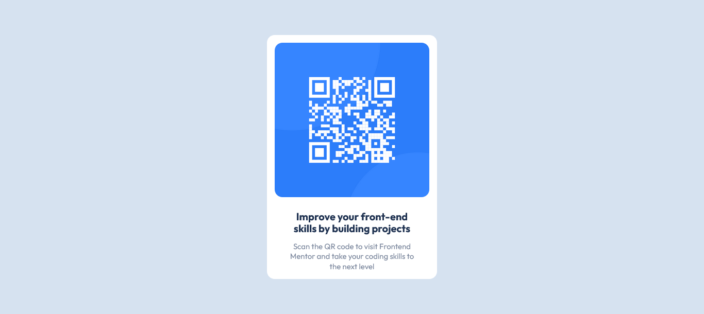

# Frontend Mentor - QR code component solution

This is a solution to the [QR code component challenge on Frontend Mentor](https://www.frontendmentor.io/challenges/qr-code-component-iux_sIO_H). Frontend Mentor challenges help you improve your coding skills by building realistic projects. 

## Table of contents

- [Overview](#overview)
  - [Screenshot](#screenshot)
  - [Links](#links)
- [My process](#my-process)
  - [Built with](#built-with)
  - [What I learned](#what-i-learned)
  - [Continued development](#continued-development)
- [Author](#author)

## Overview

### Screenshot



### Links

- Solution URL: [Add solution URL here](https://www.frontendmentor.io/solutions/qr-code-component-html-css-cwcYshdiVP)
- Live Site URL: [Add live site URL here](https://alberto170.github.io/QR-code-component---Frontend-Mentor/)

## My process

### Built with

- Semantic HTML5 markup
- CSS custom properties
- Flexbox
- Mobile-first workflow

### What I learned

how to center a div vertically with position relative and absolute.

```css
.main {
    position: relative;
}

.container {
    margin: 0;
    position: absolute;
    top: 50%;
    left: 50%;
    -ms-transform: translate(-50%, -50%);
    transform: translate(-50%, -50%);
}
```

### Continued development

All these challenges that put my knowledge to the test, make me continue studying to continue improving more and more as a developer.

## Author

- Linkedin - [Alberto Martinez](https://www.linkedin.com/in/alberto-martinez-a147b4132)
- Frontend Mentor - [@Eltunas170](https://www.frontendmentor.io/profile/Eltunas170)
- Twitter - [@AlbertoMtz170](https://twitter.com/AlbertoMtz170)

